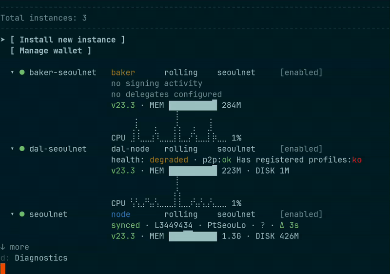

# Octez Manager

A command-line tool and terminal UI for managing Octez services (nodes, bakers, accusers, signers, DAL nodes) as systemd units.



> **Warning**
> Octez Manager is experimental. Use at your own risk on testnets only.

## Features

- Install and manage Octez daemons as systemd services
- Terminal UI for interactive management
- Snapshot import from tzinit.org
- Network discovery from teztnets.com
- Service lifecycle management (start, stop, restart, purge)

## Quick Start

### Prerequisites

```sh
# Pin miaou (not yet on opam)
opam pin add miaou <path-to-miaou-repo>

# Install dependencies and build
opam install . --deps-only --with-test
dune build
```

### Install a Node

```sh
octez-manager install-node \
  --instance my-node \
  --network mainnet \
  --history-mode rolling \
  --snapshot rolling
```

### Launch the UI

```sh
octez-manager ui
```

The UI provides:
- Service overview with status monitoring
- Installation wizards for all service types
- Log viewing and service actions
- Snapshot management

### CLI Commands

```sh
# List services
octez-manager list

# Service actions
octez-manager instance <name> start|stop|restart|purge

# Install other services
octez-manager install-baker --help
octez-manager install-accuser --help
octez-manager install-signer --help
octez-manager install-dal-node --help

# Snapshot management
octez-manager list-snapshots --network mainnet
octez-manager snapshots import --instance my-node
```

Run `octez-manager --help` for all commands.

## Documentation

- [CONTRIBUTING.md](./CONTRIBUTING.md) - Contribution guidelines
- [SECURITY.md](./SECURITY.md) - Security policy

## License

MIT - see [LICENSE](LICENSE).

**Maintainer:** Nomadic Labs (<contact@nomadic-labs.com>)
